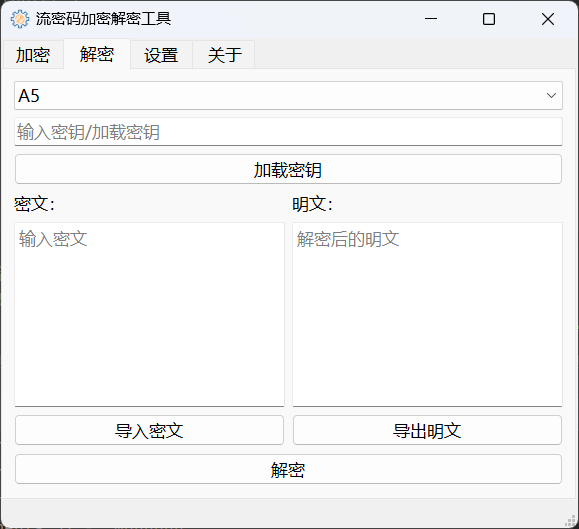

# 序列密码管理系统

这是一个简易的序列密码加密/解密系统，使用SQLite3和MongoDB作为数据库。
代码较乱，仅做参考。
# 要求

- [Python](https://www.python.org/downloads/) 

- [MongoDB](https://www.mongodb.com/try/download/community)（可选安装，但需要在`database/config.yaml`中指定数据库）

# 界面





# 使用

1. 创建虚拟环境

```Shell
conda create -n stream-cipher-tool python==3.8
```

2. 安装依赖

```Shell
pip install -r requirement.txt -i https://pypi.tuna.tsinghua.edu.cn/simple/
```

3. 激活虚拟环境

```Shell
conda activate stream-cipher-tool
```

4. 克隆本项目或[下载压缩包](https://github.com/Agiens02/stream-cipher-tool/archive/refs/heads/master.zip)

```Shell
git clone https://github.com/Agiens02/stream-cipher-tool.git
cd stream-cipher-tool
```

5. 运行主界面

```Shell
python MainWindow.py
```

# 注意
- 管理界面密码默认0000，可在`database/config.yaml`中修改
- 图标来源[阿里矢量图标库](https://www.iconfont.cn/)


